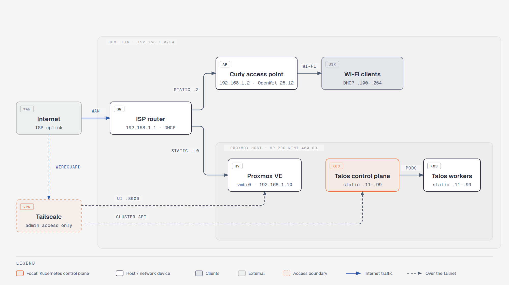

# Homelab

I am rebuilding my homelab on [Talos](https://www.talos.dev/), an
immutable, API-managed Kubernetes OS, instead of a general-purpose Linux
distro running Kubernetes on top.

At work I already run Kubernetes on RKE2, GKE and AKS. This is not my
first homelab either, so the point here is not to learn Kubernetes from
scratch. The point is to learn the parts I do not touch at work: Talos
itself, and around it, open source tools or tools I have not used
professionally. New and open source tools are preferred, but it is not a
hard rule: when something I already know is still the best fit, it stays.

## Goals

- **Learn Talos**: API and machine configs only, no SSH.
- **Try new tools**: open source over what I use at work, unless clearly worse.
- **Fully public**: every config, decision and dead end, reverted ones too.
- **No exposed secrets**: encrypted or kept out of git, no real IPs or hostnames.
- **Private management**: admin interfaces only over the tailnet.
- **Reproducible**: rebuild everything from this repo, VMs included.
- **Diagrams**: show how host, VMs, network and secrets connect.

## Hardware

A single mini PC running Proxmox VE, with the Talos nodes as VMs on top,
plus the home network it sits on.

<picture>
  <source media="(prefers-color-scheme: dark)" srcset="diagrams/network-dark.png">
  
</picture>

### Proxmox host

| Component | Detail |
|-----------|--------|
| Model | HP Pro Mini 400 G9 |
| CPU | Intel Core i5-12500T, 6 cores / 12 threads, 35 W |
| RAM | 32 GB DDR4-3200 (2 x 16 GB, both slots used, max 64 GB) |
| Storage | Intel 670p 512 GB NVMe (QLC) |
| Network | Intel I219-LM gigabit, single port, no Wi-Fi |
| GPU | Intel UHD Graphics 770 (integrated) |

### Network

| Device | Detail |
|--------|--------|
| Router | ISP-provided, gateway and DHCP server |
| Access point | Cudy router running OpenWrt 25.12, DHCP disabled |

LAN `192.168.1.0/24`:

| Range | Type | Use |
|-------|------|-----|
| `192.168.1.1` | Static | ISP router |
| `192.168.1.2` | Static | Access point |
| `192.168.1.10` | Static | Proxmox |
| `192.168.1.11` to `.99` | Static | Talos nodes and other lab machines |
| `192.168.1.100` to `.254` | Dynamic (DHCP) | Phones, laptops and other clients |

## Core stack

What I already know, from work, earlier homelabs or elsewhere, and what
this homelab uses instead. `/` separates alternatives, `+` means used
together.

### Infrastructure

| Area | Already used | Candidate |
|------|--------------|-----------|
| Hypervisor | vSphere, XCP-ng, Proxmox VE | **Proxmox VE** |
| Kubernetes | GKE, AKS, RKE2 | **Talos** |
| IaC | Terraform | **OpenTofu** |
| Config management | Ansible | **Ansible** |
| Remote access | Cloudflare Tunnel | **Tailscale** / **Headscale** |

### Delivery

| Area | Already used | Candidate |
|------|--------------|-----------|
| Git and CI/CD | GitHub, GitLab, Jenkins, Azure DevOps | **Forgejo** / **Gitea** |
| GitOps | Argo CD | **Flux** |
| Container registry | JFrog Artifactory, Nexus | **Harbor** / **Zot** |
| Dependency updates | Renovate | **Renovate** |

### Cluster Components

| Area | Already used | Candidate |
|------|--------------|-----------|
| CNI | Canal (Calico + Flannel) | **Cilium** |
| Service mesh | Istio | **Cilium** |
| Load balancer | kube-vip, GKE and AKS cloud load balancers | **Cilium** / **MetalLB** |
| Ingress | Traefik, Istio | **Envoy Gateway** / **Cilium** |
| Certificates | cert-manager, step-ca, Traefik ACME, Istio CA (mTLS) | **cert-manager** + **step-ca** |
| Autoscaling | KEDA | **KEDA** |

### Security

| Area | Already used | Candidate |
|------|--------------|-----------|
| SSO | Authentik, Keycloak | **Kanidm** / **Zitadel** / **Authelia** |
| Secrets | HashiCorp Vault | **SOPS** + **age** / **OpenBao** / **SecretSpec** |
| Policy | Kyverno | **Kyverno** / **OPA Gatekeeper** / **Kubewarden** |
| Runtime security | Falco | **Falco** / **Tetragon** |
| Vulnerability scanning | Trivy | **Trivy** / **Grype** |
| SBOM | CycloneDX, Dependency-Track | **Syft** + **Dependency-Track** |

### Storage and Data

| Area | Already used | Candidate |
|------|--------------|-----------|
| Block storage | local-path-provisioner, GKE and AKS managed disks | **Longhorn** |
| Object storage | MinIO, Google Cloud Storage, Azure Blob Storage | **Garage** / **SeaweedFS** / **RustFS** / **Ceph** |
| Databases | Postgres, managed cloud and on-prem | **CloudNativePG** |
| Backup | Cloud-managed Postgres backups | **Velero** + **Talos etcd snapshots** + **Proxmox Backup Server** |

### Observability

| Area | Already used | Candidate |
|------|--------------|-----------|
| Metrics | Prometheus | **VictoriaMetrics** |
| Logs | Loki | **VictoriaLogs** |
| Traces | Tempo, OpenTelemetry | **Jaeger** / **VictoriaTraces** |
| Dashboards | Grafana | **Grafana** / **Perses** |

## Work in progress

The build, step by step, in the order it was done. One page per phase,
with the tools, the options chosen and why.

| Phase | Covers |
|-------|--------|
| [01. Proxmox](docs/01-proxmox.md) | Install USB, install, post-install |
| [02. Talos](docs/02-talos.md) | VM template |

## Open questions

- Can Talos run **fully in-memory** (diskless boot)? Understand how that actually works before committing to it as a design constraint.

## Use of AI

AI (Claude) helps with documentation, diagrams and commit messages in this
repo. Decisions, hardware and the actual build are done by hand.

## References

- [Talos + Tailscale walkthrough (YouTube)](https://www.youtube.com/watch?v=3VpOYn_GfAY)
- [ironicbadger/infra](https://github.com/ironicbadger/infra): reference homelab infra repo
- [ironicbadger/k8s](https://github.com/ironicbadger/k8s): reference k8s config repo
