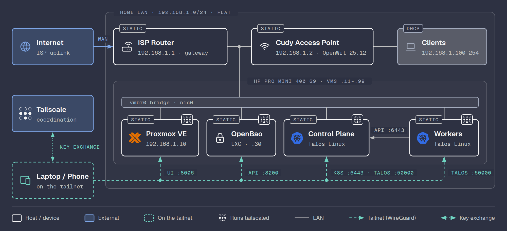
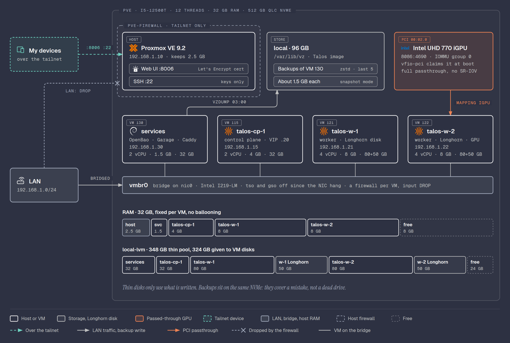

# Homelab

I am rebuilding my homelab on [Talos](https://www.talos.dev/), an
immutable, API-managed Kubernetes OS, instead of a general-purpose Linux
distro running Kubernetes on top.

At work I already run Kubernetes on RKE2, GKE and AKS. This is not my
first homelab either, so the point here is not to learn Kubernetes from
scratch. The point is to learn the parts I do not touch at work: Talos
itself, and around it, open source tools or tools I have not used
professionally. New and open source tools are preferred, but it is not a
hard rule: when something I already know is still the best fit, it stays.

## Goals

- **Learn Talos**: API and machine configs only, no SSH.
- **Try new tools**: open source over what I use at work, unless clearly worse.
- **Fully public**: every config, decision and dead end, reverted ones too.
- **No exposed secrets**: passwords, keys and tokens encrypted or kept out of git.
- **Private management**: admin interfaces only over the tailnet.
- **Reproducible**: rebuild everything from this repo, VMs included.
- **GitOps**: git is the source of truth, changes land as commits and apply themselves.
- **Automation**: nothing done by hand twice.
- **Diagrams**: show how host, VMs, network and secrets connect.

## Diagrams

  
   
  <b>Overview.</b> One flat LAN, Talos VMs bridged onto it, management over Tailscale only.

  
   
  <b>Proxmox.</b> Planned split of RAM and disk between the host, one control plane and three workers. Production needs three control planes for etcd quorum; one is used here to leave more room for apps (<a href="docs/01-proxmox.md#planned-vms">why</a>).

  
   
  <b>Tailscale.</b> At home, direct over the LAN. Away from home, direct over the internet, with a relay as fallback (<a href="docs/02-tailscale.md#how-traffic-flows">how</a>).

## Hardware

The host and the home network it sits on.

### Proxmox host

| Component | Detail |
|-----------|--------|
| Model | HP Pro Mini 400 G9 |
| CPU | Intel Core i5-12500T, 6 cores / 12 threads, 35 W |
| RAM | 32 GB DDR4-3200 (2 x 16 GB, both slots used, max 64 GB) |
| Storage | Intel 670p 512 GB NVMe (QLC) |
| Network | Intel I219-LM gigabit, single port, no Wi-Fi |
| GPU | Intel UHD Graphics 770 (integrated) |

### Network

| Device | Detail |
|--------|--------|
| Router | ISP-provided, gateway and DHCP server |
| Access point | Cudy router running OpenWrt 25.12, DHCP disabled |

LAN `192.168.1.0/24`:

| Range | Type | Use |
|-------|------|-----|
| `192.168.1.1` | Static | ISP router |
| `192.168.1.2` | Static | Access point |
| `192.168.1.10` | Static | Proxmox |
| `192.168.1.11` to `.19` | Static | Talos control plane |
| `192.168.1.20` | Static | Kubernetes API VIP |
| `192.168.1.21` to `.49` | Static | Talos workers and other lab machines |
| `192.168.1.50` to `.99` | Static | Cilium LoadBalancer pool |
| `192.168.1.100` to `.254` | Dynamic (DHCP) | Phones, laptops and other clients |

## Core stack

What I already know, from work, earlier homelabs or elsewhere, and what
this homelab uses instead. `/` separates alternatives, `+` means used
together.

### Infrastructure

| Area | Already used | Candidate |
|------|--------------|-----------|
| Hypervisor | vSphere, XCP-ng, Proxmox VE | **Proxmox VE** |
| Kubernetes | GKE, AKS, RKE2 | **Talos** |
| IaC | Terraform | **OpenTofu** |
| Config management | Ansible | **Ansible** |
| Remote access | Cloudflare Tunnel | **Tailscale** / **Headscale** |

### Delivery

| Area | Already used | Candidate |
|------|--------------|-----------|
| Git and CI/CD | GitHub, GitLab, Jenkins, Azure DevOps | **Forgejo** / **Gitea** |
| GitOps | Argo CD | **Flux** |
| Container registry | JFrog Artifactory, Nexus | **Harbor** / **Zot** |
| Dependency updates | Renovate | **Renovate** |

### Cluster Components

| Area | Already used | Candidate |
|------|--------------|-----------|
| CNI | Canal (Calico + Flannel) | **Cilium** |
| Service mesh | Istio | **Cilium** |
| Load balancer | kube-vip, GKE and AKS cloud load balancers | **Cilium** / **MetalLB** |
| Ingress | Traefik, Istio | **Envoy Gateway** / **Cilium** |
| Certificates | cert-manager, step-ca, Traefik ACME, Istio CA (mTLS) | **cert-manager** + **step-ca** |
| Autoscaling | KEDA | **KEDA** |

### Security

| Area | Already used | Candidate |
|------|--------------|-----------|
| SSO | Authentik, Keycloak | **Kanidm** / **Zitadel** / **Authelia** |
| Secrets | HashiCorp Vault | **SOPS** + **age** / **OpenBao** / **SecretSpec** |
| Policy | Kyverno | **Kyverno** / **OPA Gatekeeper** / **Kubewarden** |
| Runtime security | Falco | **Falco** / **Tetragon** |
| Brute-force protection | None | **CrowdSec** + **Envoy Gateway** rate limits |
| Vulnerability scanning | Trivy | **Trivy** / **Grype** |
| SBOM | CycloneDX, Dependency-Track | **Syft** + **Dependency-Track** |

### Storage and Data

| Area | Already used | Candidate |
|------|--------------|-----------|
| Block storage | local-path-provisioner, GKE and AKS managed disks | **Longhorn** |
| Object storage | MinIO, Google Cloud Storage, Azure Blob Storage | **Garage** / **SeaweedFS** / **RustFS** / **Ceph** |
| Databases | Postgres, managed cloud and on-prem | **CloudNativePG** |
| Backup | Cloud-managed Postgres backups | **Velero** + **Talos etcd snapshots** + **Proxmox Backup Server** |

### Observability

| Area | Already used | Candidate |
|------|--------------|-----------|
| Metrics | Prometheus | **VictoriaMetrics** |
| Logs | Loki | **VictoriaLogs** |
| Traces | Tempo, OpenTelemetry | **Jaeger** / **VictoriaTraces** |
| Dashboards | Grafana | **Grafana** / **Perses** |

## Work in progress

The build, step by step, in the order it was done. One page per phase,
with the tools, the options chosen and why.

| Phase | Covers |
|-------|--------|
| [01. Proxmox](docs/01-proxmox.md) | Install USB, install, post-install, planned VMs |
| [02. Tailscale](docs/02-tailscale.md) | Account, laptop, Proxmox host, hardening |

## Backlog

Things skipped for now or not to forget. Removed once they land in a
phase page.

### Proxmox host

- [ ] Back up `/etc/pve` off the host (firewall, users, 2FA, VM configs).
- [ ] Early NVMe wear alert on "percentage used" (for example 80%),
      once monitoring is in place.
- [ ] UPS with NUT for a clean shutdown on power loss.
- [ ] Test the web UI over tailnet IPv6 from a phone.

### Tailscale

- [ ] Sync `tailscale/policy.hujson` to the tailnet from git (GitOps).

### Before Talos

- [ ] Dedicated Proxmox user and API token for OpenTofu.
- [ ] API access: VIP, `certSANs`, multi-endpoint `talosconfig`, DNS name.
- [ ] VM network: IPv6 RA off, KubeSpan off, Cilium devices pinned to the
      LAN NIC.
- [ ] Restrict `6443` and `50000` on the VMs.
- [ ] Lockout runbook with etcd snapshots.
- [ ] NTP check.
- [ ] Brute-force protection (CrowdSec) for anything exposed to the
      internet through an ingress.

## Open questions

- Can Talos run **fully in-memory** (diskless boot)? Understand how that actually works before committing to it as a design constraint.

## References

General inspiration and reference repos. Links for a specific phase live
at the end of its page in [docs/](docs/).

- [Talos + Tailscale walkthrough (YouTube)](https://www.youtube.com/watch?v=3VpOYn_GfAY)
- [ironicbadger/infra](https://github.com/ironicbadger/infra): reference homelab infra repo
- [ironicbadger/k8s](https://github.com/ironicbadger/k8s): reference k8s config repo
