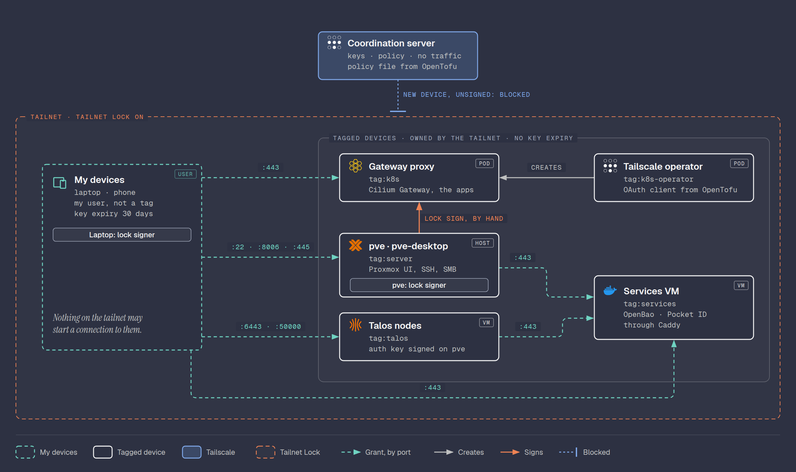

# Tailscale

Remote admin access to the homelab over a WireGuard mesh, with no ports
opened on the router.

## Why Tailscale

- **Free** for this use: the Personal plan covers 6 users, unlimited user
  devices and 50 tagged devices.
- **End-to-end encrypted** with WireGuard. Private keys never leave the
  devices, and no port is forwarded on the router. The only listening port
  is WireGuard's own, which answers nothing without a valid key.
- **What is trusted:** Tailscale's coordination server decides which
  devices join the tailnet and sees metadata (devices, connection times),
  never traffic. Tailnet Lock removes the ability to add devices without a
  signature from one of my own nodes.
- **Headscale** (self-hosted coordination server) stays a later
  experiment. Moving to it only means re-joining the devices.

## Where it runs

Directly on each node that needs remote access, not as a subnet router:

| Node | How |
|------|-----|
| Proxmox host | `tailscaled` on the Debian base system |
| Admin laptop | Tailscale Windows app (WSL shares its network) |
| Phone | Tailscale Android app |
| Talos VMs | Tailscale system extension, in the Talos phase |

## How traffic flows



The laptop and the phone can each be at home or away; the path depends on
where the device is, not which device it is.

- **At home:** the device and `pve` talk directly over the LAN. Packets
  never leave the house (`tailscale ping pve` shows a `192.168.1.x` address
  and about 1 ms).
- **Away:** the device reaches `pve` directly over the internet. Both sides
  connect outward at the same time ("hole punching"), so no port is
  forwarded on the router.
- **Fallback:** when a direct path is impossible (strict NAT, blocked UDP),
  traffic goes through a Tailscale **DERP relay**. Still WireGuard
  encrypted end to end: the relay only passes packets it cannot read.
- **Coordination server:** hands out keys, the device list and the policy.
  It never carries traffic.

## Account and devices

- **Account:** signed in with GitHub, protected by a passkey or security
  key rather than codes that can be phished. Whoever controls that login
  controls the tailnet: Tailnet Lock stops it from adding devices, but
  not from editing the policy or removing devices.
- **Laptop:** Tailscale Windows app. WSL goes
  through the Windows network, so commands run in WSL reach the tailnet
  too.
- **Phone:** Tailscale Android app, for access away from home.
- **MagicDNS** is on, so every device gets a name under
  `<tailnet>.ts.net`.

Key expiry is set to **30 days** for the tailnet (default 180), so the
laptop and phone log in again once a month and a lost device loses access
on its own. `pve` is exempt: expiry disabled by hand, and tagged devices
never expire anyway.

## Proxmox host

Installed from Tailscale's official apt repository, in the same deb822
format as the Proxmox one. Signing key fingerprint:
`2596 A99E AAB3 3821 893C 0A79 458C A832 957F 5868`.

```bash
curl -fsSL https://pkgs.tailscale.com/stable/debian/trixie.noarmor.gpg \
  -o /usr/share/keyrings/tailscale-archive-keyring.gpg
```

```
# /etc/apt/sources.list.d/tailscale.sources
Types: deb
URIs: https://pkgs.tailscale.com/stable/debian
Suites: trixie
Components: main
Signed-By: /usr/share/keyrings/tailscale-archive-keyring.gpg
```

```bash
apt update && apt install tailscale
tailscale up --hostname=pve   # prints a login URL, approved in the browser
```

Then, in the [admin console](https://login.tailscale.com/admin/machines),
**⋯ → Disable key expiry** on `pve`. A server should not drop off the
tailnet when its key expires.

MagicDNS is turned off **on `pve` only**:

```bash
tailscale set --accept-dns=false
```

By default Tailscale rewrites `/etc/resolv.conf` to its own resolver
(`100.100.100.100`). Every name lookup on the host, for apt, the email
alerts and NTP, would then depend on `tailscaled` running. With it off,
the host keeps the `1.1.1.1` set in the installer, so updates and alerts
keep working even when Tailscale is down. The host never needs to look up
other tailnet names; the laptop and phone still use MagicDNS.

Tailscale is the only way in, so it updates itself:

```bash
tailscale set --auto-update
```

The host's unattended upgrades only cover Debian security fixes (see
[01. Proxmox](01-proxmox.md#automatic-security-updates)), so without this
the Tailscale package from its own apt repository would only update with
a manual `apt full-upgrade`. An update needs no reboot, only a restart of
`tailscaled`, which drops tailnet sessions (SSH included) for a few
seconds.

Check from the laptop:

```bash
tailscale status                          # pve listed with a 100.x address
curl -sk -o /dev/null -w '%{http_code}\n' https://pve.<tailnet>.ts.net:8006   # 200
```

The web UI is now at `https://pve.<tailnet>.ts.net:8006` from any device on
the tailnet.

## Useful commands

| Command | What it does |
|---------|--------------|
| `tailscale status` | Devices on the tailnet, their IPs, and whether traffic is flowing |
| `tailscale ip -4` | This device's tailnet IPv4 address |
| `tailscale ping pve` | Pings over the tailnet and says whether the path is direct or via a DERP relay |
| `tailscale netcheck` | NAT type, UDP reachability and latency to each DERP region |
| `tailscale whois 100.x.y.z` | Which device and user own a tailnet IP |
| `tailscale up --hostname=NAME` | Joins the tailnet (first time) or changes settings |
| `tailscale down` | Disconnects without logging out |
| `tailscale logout` | Leaves the tailnet; the device must be approved again |
| `tailscale set --hostname=NAME` | Changes one setting without re-running `up` |
| `tailscale set --accept-dns=false` | Stops Tailscale from managing this device's DNS |
| `tailscale set --auto-update` | Installs new Tailscale versions automatically |
| `tailscale version` | Client version |
| `tailscale debug prefs` | The current settings in full |
| `systemctl status tailscaled` | The daemon on Linux |
| `journalctl -u tailscaled -f` | Follow the daemon's logs |

`tailscale ping` is the one to reach for first when something is slow:
"via DERP" means traffic is relayed rather than direct.

## Tailnet Lock

With Tailnet Lock on, a device can only join if one of my own **signing
nodes** signs it. Tailscale approving the login is no longer enough, which
removes the trust in Tailscale's coordination server to decide membership.

- **Signing nodes:** `pve` and the laptop. At least two are required.
  Android cannot sign, but the phone was signed at setup and keeps working.
- **Enabled from** admin console → **Settings → Device management → Enable
  Tailnet Lock**, picking the two signing nodes. It generates a
  `tailscale lock init …` command, run once on a signing node. Init signs
  every device already in the tailnet.
- **Disablement secrets:** init prints 10, shown only once. One is needed
  to ever turn the lock off; losing all of them makes the tailnet
  unrecoverable. Stored in Bitwarden, plus a printed copy kept offline in
  case the vault itself is lost. None was sent to Tailscale support,
  since that would let Tailscale undo the lock.
- **Init was run by hand** in a terminal, so the secrets were never
  written to any file or log.

### Reading `tailscale lock status`

Think of it as a guest list. Two devices hold the pen (the signing
nodes), and every device on the list carries a signed pass.

```
Tailnet Lock is ENABLED.

This node is accessible under Tailnet Lock. Node signature:
SigKind: direct
Pubkey: [UYAWt]
KeyID: tlpub:6734…
WrappingPubkey: tlpub:c684…

This node's tailnet-lock key: tlpub:c684…

Trusted signing keys:
	tlpub:c684…	1	(self)
	tlpub:6734…	1
```

- **`ENABLED`**: the lock is on for the whole tailnet.
- **`accessible under Tailnet Lock`**: this device has a valid pass, so
  the others talk to it. A device without one is ignored.
- **Node signature**: the pass itself.
  - `SigKind: direct`: signed directly by one of the pens.
  - `Pubkey`: short form of the identity the pass is for (this device).
  - `KeyID`: which pen signed it. Here `6734…`, the laptop, because the
    laptop ran `init` and signed everyone.
  - `WrappingPubkey`: this device's own pen, so it can renew its own pass
    when its identity rotates, without asking anyone.
- **`This node's tailnet-lock key`**: this device's pen. `c684…` is
  `pve`. Its private half never leaves the device.
- **`Trusted signing keys`**: the list of pens: `c684…` (`pve`, marked
  `self`) and `6734…` (the laptop). Only these can sign in a new device.
  The `1` is a vote, used only when changing this list.

### Adding a device later

A new device logs in as usual, then shows as locked out until a signing
node signs it:

```bash
tailscale lock status              # on the new device: prints its node key
tailscale lock sign nodekey:… tlpub:…   # on pve or the laptop
```

The Windows app can also sign from a link shown in the admin console.

## Access rules

The default policy lets every device reach every other device on every
port. Replaced with [tailscale/policy.hujson](../tailscale/policy.hujson),
pasted into admin console → **Access controls**:

- **Tags** mark what a device is. Tagged devices belong to the tailnet, not
  a person, and never expire. A tag must exist in the policy
  (`tagOwners`) before it can be assigned (Machines → ⋯ → **Edit ACL
  tags**).

  | Tag | Devices |
  |-----|---------|
  | `tag:server` | `pve` |
  | `tag:openbao` | The OpenBao container |
  | `tag:talos` | The Talos nodes |

- **Grants**, the only traffic allowed:

  | From | To | Ports |
  |------|----|-------|
  | My devices (user `jotavare@github`: laptop, phone) | `tag:server` | `22`, `8006` |
  | My devices | `tag:talos` | `6443`, `50000` |
  | My devices and `tag:talos` | `tag:openbao` | `8200` |

- **Nothing in the other direction:** a compromised server, container or
  node cannot start a connection to the laptop, and none of them can reach
  each other except Talos to OpenBao.
- **`tests`** run on every save, so a broken rule is rejected before it
  applies. They check every row above plus the ports and directions that
  must stay closed.

The grant names my user, not `autogroup:member`. That group means every
user in the tailnet, so anyone invited later (family, a friend) would get
the same admin ports on every server. With the user named, a new member
gets nothing until a rule says otherwise.

Rules target users or tags, not a single personal device. Tagging the
laptop to make it "the only admin device" would strip its owner and key
expiry, so the phone is allowed too.

Checked from the laptop after the change:

| Path | Result |
|------|--------|
| laptop → `pve:8006` over the tailnet | allowed |
| laptop → `pve:22` over the tailnet | allowed |
| laptop → `pve:111` over the tailnet | blocked |
| `pve` → laptop over the tailnet | blocked |

The repo file is the reference copy. Syncing it automatically from git
(Tailscale's GitOps action) comes with the CI setup.

## Hardening

The tailnet rules only cover traffic over Tailscale. The LAN side is
closed by the Proxmox firewall: see [01. Proxmox, Firewall](01-proxmox.md#firewall).
It still accepts Tailscale's own UDP port (`41641`) from any source, on
purpose: direct connections at home and hole punching from away both
arrive there. WireGuard drops every packet that is not signed by a known
device key, so the open port exposes nothing else. From the internet it
is only reachable while a hole-punched session is open, since the router
forwards no ports.

## References

- [What is Tailscale](https://tailscale.com/kb/1151/what-is-tailscale)
- [Pricing](https://tailscale.com/pricing)
- [Install on Linux](https://tailscale.com/kb/1031/install-linux)
- [Key expiry](https://tailscale.com/kb/1028/key-expiry)
- [Tailnet Lock](https://tailscale.com/kb/1226/tailnet-lock)
- [Access control (ACLs)](https://tailscale.com/kb/1018/acls)
- [Grants](https://tailscale.com/kb/1324/grants)
- [Tags](https://tailscale.com/kb/1068/tags)
- [GitOps for the policy file](https://tailscale.com/kb/1204/gitops-acls)
- [MagicDNS](https://tailscale.com/kb/1081/magicdns)
- [HTTPS certificates](https://tailscale.com/kb/1153/enabling-https)
- [Headscale](https://github.com/juanfont/headscale)

[Back to the build log](../README.md#work-in-progress)
