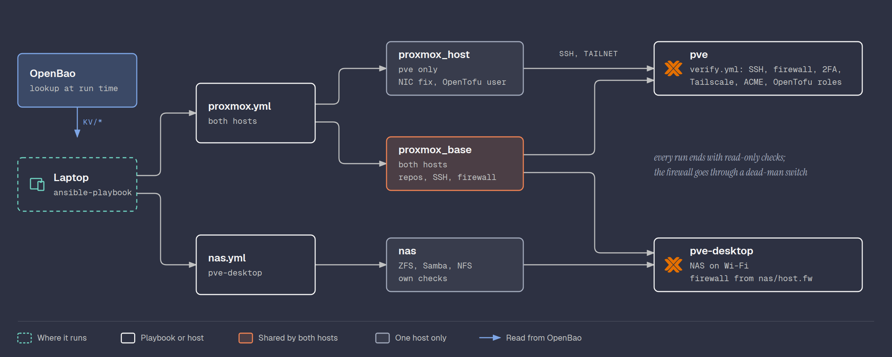

# Ansible

The configuration of the two Proxmox hosts as code: `proxmox.yml` brings
a freshly installed host to the state described in
[Proxmox](proxmox.md) and [Tailscale](tailscale.md), and
`nas.yml` turns `pve-desktop` into the NAS ([NAS](nas.md)).
Ansible only does what lives on a host and needs `root`; what an API can
create is in OpenTofu.



## Why Ansible

The host steps were done by hand first, to learn them. Doing them by hand
again after a reinstall goes against two goals, Reproducible and
Automation. Ansible is already a tool I know from work, and it fits here:
the host is a normal Debian system with SSH, and the playbook only needs
SSH and Python on it.

Talos VMs are a different story: no SSH, no shell, configured through
their API. They come later with OpenTofu, not Ansible.

## Install

Ansible runs on the laptop (WSL). Installed with
[uv](https://docs.astral.sh/uv/), which needs no root and no
`python3-venv` package:

```bash
curl -LsSf https://astral.sh/uv/install.sh | sh
uv tool install --with hvac ansible-core
uv tool install ansible-lint
ansible-galaxy collection install -r requirements.yml
```

## Layout

| Path | What it is |
|------|------------|
| [ansible/ansible.cfg](../ansible/ansible.cfg) | Settings: inventory, roles path, YAML output |
| [ansible/inventory.yml](../ansible/inventory.yml) | The hosts `pve` and `pve-desktop`, reached at their tailnet addresses (`proxmox_host` and `nas_host` in OpenBao `kv/config`, so they stay out of the repo). `pve-desktop` picks its own firewall file |
| [ansible/group_vars/all.yml](../ansible/group_vars/all.yml) | Reads `kv/config` from OpenBao with the `community.hashi_vault` lookup |
| [ansible/proxmox.yml](../ansible/proxmox.yml) | The playbook for the hosts: `proxmox_base` and `proxmox_access` on both, `proxmox_host` on `pve` only |
| [ansible/nas.yml](../ansible/nas.yml) | The NAS on `pve-desktop` ([NAS](nas.md)) |
| [ansible/requirements.yml](../ansible/requirements.yml) | The `community.proxmox` and `community.hashi_vault` collections |
| [ansible/roles/proxmox_base/](../ansible/roles/proxmox_base/) | What every Proxmox host gets: repositories, unattended upgrades, SSH hardening, IPv6 autoconf off, Tailscale, the root password from OpenBao, the firewall behind the dead-man switch |
| [ansible/roles/proxmox_host/](../ansible/roles/proxmox_host/) | What only `pve` gets: smartd for the NVMe, the NIC offload fix, the iGPU bound to `vfio-pci`, and the compliance checks (`tasks/verify.yml`) |
| [ansible/roles/proxmox_access/](../ansible/roles/proxmox_access/) | Who may do what on each host: the OpenTofu user with one role per path (all three on `pve`, only `TofuRealms` on `pve-desktop`, set in the inventory), the ACME account, the SSO admin once the realm exists, and on `pve-desktop` the web UI certificate. Its checks fail if the user has a role it should not |
| [ansible/roles/nas/](../ansible/roles/nas/) | The NAS: ZFS pool, the Immich library quota, Samba, NFS, WiFi power saving, and its own checks |
| [proxmox/](../proxmox/), [nas/](../nas/) | The config files the roles copy. Each file lives in one place and is explained in [Proxmox](proxmox.md) or [NAS](nas.md) |

## What it covers

| Covered by the playbook | Still manual |
|-------------------------|--------------|
| Enterprise repos off, no-subscription and Tailscale repos on | Installing Proxmox, the network settings (and the WiFi on `pve-desktop`) |
| Tailscale signing key, checked by SHA256 | Web UI 2FA and recovery keys |
| Root password, from OpenBao `kv/hosts/<host>` with its stored salt, so the hash is the same on every run | |
| TSO and GSO off on `nic0` of `pve`, now and at boot ([Proxmox, NIC hang](proxmox.md#nic-hang)) | |
| `unattended-upgrades` and its drop-in | Copying the SSH key (`ssh-copy-id`) |
| SSH hardening drop-in, validated with `sshd -t` before it is written | Full upgrade and reboot after the install |
| IPv6 sysctl, smartd config | `tailscale up` login, tag, key expiry, Tailnet Lock signature |
| `rpcbind` off (NFSv4 needs none) | SMTP notification target (its password is in OpenBao `kv/hosts/pve`) |
| Tailscale `--accept-dns=false --auto-update` | The OpenTofu API token (a secret) |
| OpenTofu user `tofu@pve` and role `TofuProvisioner` | |
| Role `TofuBackupStorage` on `/storage/local` only | |
| Role `TofuRealms` on `/access/realm` only | |
| User `jotavare@pocket-id` with `Administrator` on `/`, once OpenTofu made the realm | |
| Let's Encrypt ACME account `default` (only `root@pam` can register one) | The Cloudflare tokens (secrets) |
| Firewall files on both hosts, behind a dead-man switch. Written with `unsafe_writes`: `/etc/pve` refuses Ansible's write-then-rename | |
| NAS on `pve-desktop`: pool, shares, exports (`nas.yml`) | |

The manual column is either a one-time install step or something that
creates or holds a secret. Those stay by hand on purpose.

## Compliance checks

Every run ends with read-only checks, in check mode too, that the host
still matches everything done since the install, including the manual
steps the playbook cannot apply. A failed check stops the run with a red
task and a pointer to the doc section.

| Check | Expects |
|-------|---------|
| Services | `ssh`, `pve-firewall`, `tailscaled`, `smartmontools` and the daily upgrade timer running |
| Not running | `rpcbind`, `fw-deadman.timer` |
| SSH | Root key only, no password or keyboard login, `MaxAuthTries 3` |
| Firewall | On, management IP sets exactly `100.64.0.0/10` and `fd7a:115c:a1e0::/48` |
| Web UI 2FA | `root@pam` has TOTP and recovery keys |
| Tailscale | Tailnet Lock enabled, `tag:server`, MagicDNS off, auto-update on, resolver `1.1.1.1` |
| IPv6, email | `accept_ra` and `autoconf` 0 on `vmbr0`, default matcher sends to the SMTP target |
| ACME | Account `default` exists, on the Let's Encrypt production directory, status `valid` |
| OpenTofu | All three roles' privileges exact, exactly three permission entries for `tofu@pve` (`/`, `/storage/local`, `/access/realm`), token `opentofu` exists |
| Pending | Reports packages to upgrade and a needed reboot (a note, not a failure) |

Only the checks, without touching anything:

```bash
ansible-playbook proxmox.yml --check --tags verify
```

## Firewall safety

A firewall change is the one task that can lock the host out. The
playbook applies it the same way as the manual procedure in
[Proxmox, Firewall](proxmox.md#firewall):

1. Compare the repo files with the host. If nothing changed, skip the
   rest.
2. Arm `fw-deadman`: `pve-firewall stop` in 5 minutes.
3. Copy `cluster.fw` and `host.fw`, wait for `pve-firewall` to load them.
4. Open a brand new SSH connection from the laptop, not the one Ansible
   already has open (that one would survive a bad rule).
5. Only if that works, stop the timer. Otherwise the firewall switches
   itself off and the host is reachable again.

Tested for real on a firewall file change: the timer was armed, the new
files loaded, a fresh SSH connection worked, and the timer was stopped.
The firewall stayed on the whole time.

## Running it

There is no wrapper script. Ansible reads OpenBao with the same login as
the `bao` CLI (`VAULT_ADDR` and `~/.vault-token`), so run `bao login` first:

```bash
cd ansible
ansible-lint proxmox.yml nas.yml              # production profile passes
ansible-playbook proxmox.yml --check --diff   # what would change
ansible-playbook proxmox.yml                  # both hosts
ansible-playbook proxmox.yml --limit pve      # one host
ansible-playbook nas.yml                      # the NAS
```

The checks in the `nas` role are in [NAS](nas.md#setup).

Ansible in this terminal needs its output sent to a file or pipe that
blocks (`> out.txt 2>&1`), otherwise it refuses to start with
"Ansible requires blocking IO". A normal terminal does not need this.

On the current host a full run reports `changed=0 failed=0`: nothing to
change, and every compliance check passes.

## References

- [Ansible documentation](https://docs.ansible.com/)
- [ansible-lint](https://docs.ansible.com/projects/lint/)
- [uv](https://docs.astral.sh/uv/)
- [Proxmox VE firewall](https://pve.proxmox.com/wiki/Firewall)

[Back to the build log](../README.md#docs)
