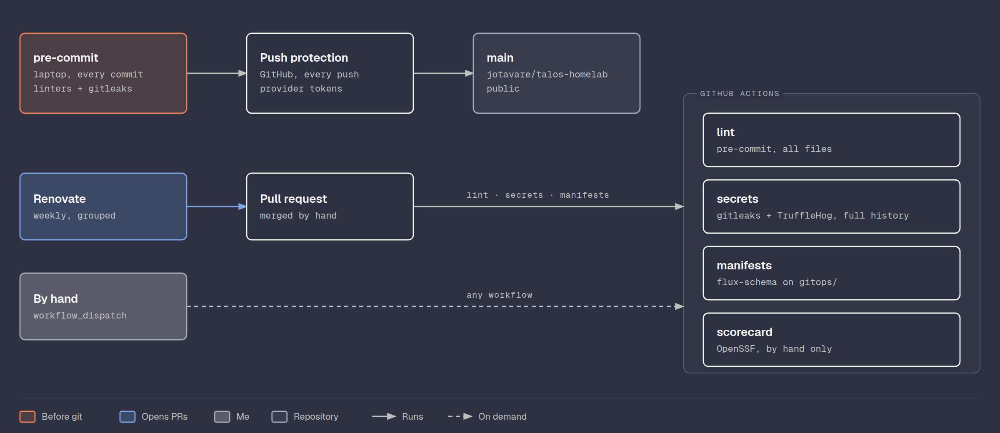

# CI

Checks for a public repository: secrets never reach GitHub, config files
stay valid, and dependency updates arrive as pull requests. Each check
lives in one place and does one thing, from the laptop to GitHub.



## Layout

| File | What |
|------|------|
| [.pre-commit-config.yaml](../.pre-commit-config.yaml) | Every linter and gitleaks, run before each commit and by the `lint` workflow |
| [.yamllint.yaml](../.yamllint.yaml) | YAML style, shared with ansible-lint |
| [.gitleaksignore](../.gitleaksignore) | Known false positives, by fingerprint |
| [iac/.tflint.hcl](../iac/.tflint.hcl) | tflint rules for OpenTofu |
| [.github/scripts/check-encrypted.sh](../.github/scripts/check-encrypted.sh) | Refuses an unencrypted `*.sops.yaml` or OpenTofu state |
| [.github/workflows/](../.github/workflows/) | One workflow per concern: `lint`, `secrets`, `manifests`, `scorecard` |
| [.github/flux-schema.env](../.github/flux-schema.env) | Example values for `${DOMAIN}` and `${TAILNET}`, so the manifests validate |
| [.github/renovate.json](../.github/renovate.json) | Renovate: what it updates, when, and in which groups |

## Secrets

Three layers, each catching what the one before can miss:

| Layer | When | Catches |
|-------|------|---------|
| gitleaks in pre-commit | Before every commit on the laptop | 150+ patterns, before the secret exists in git |
| GitHub push protection | Every push, on GitHub | Provider tokens (Cloudflare, GitHub, AWS…), even if pre-commit was skipped |
| `secrets` workflow | Pull requests and by hand | gitleaks and TruffleHog over the full history, two sets of patterns |

TruffleHog runs with `--no-verification`: by default it tries every key it
finds against the provider to see if it still works, which sends the key
out. GitHub's validity checks and non-provider patterns need GitHub
Advanced Security, so only scanning and push protection are on.

The first full scan found one thing, twice: a SHA-256 checksum of a
public download in an old Ansible role, which the generic API key rule
mistakes for a key. It is in `.gitleaksignore`.

## Lint

pre-commit runs these on the staged files before each commit, and the
`lint` workflow runs them on every file:

| Hook | Checks |
|------|--------|
| pre-commit-hooks | Valid YAML and JSON, private keys, merge markers, large files, line endings, trailing spaces |
| check-encrypted | `*.sops.yaml` and OpenTofu state are encrypted |
| gitleaks | Secrets in the staged changes |
| yamllint | YAML style |
| tofu fmt, tflint | OpenTofu formatting and mistakes |
| ansible-lint | Ansible playbooks and roles |
| actionlint, zizmor | The workflows: correctness, and security (injection, broad tokens, unpinned actions) |

Two tflint rules are off: `terraform_required_version` and
`terraform_required_providers`. Versions are pinned once, in
[iac/versions.tf](../iac/versions.tf), not again in every module.

The vendored Gateway API CRDs are left exactly as upstream ships them, so
pre-commit skips that file.

```bash
uv tool install pre-commit
pre-commit install
pre-commit run --all-files
```

tflint has to be on the `PATH` too, with its plugin installed once:
`tflint --init --config=iac/.tflint.hcl`. The first run builds gitleaks
and actionlint from source, so it downloads a Go toolchain and takes a
while; later runs reuse it.

This replaces the old `.githooks/pre-commit` and `core.hooksPath`.
pre-commit refuses to install while `core.hooksPath` is set:

```bash
git config --unset core.hooksPath
```

## Manifests

The `manifests` workflow validates everything in `gitops/` with
[flux-schema](https://github.com/fluxcd/flux-schema), Flux's own
validator. It builds each Kustomization and checks every resource against
the Kubernetes and Flux schemas and a catalog of CRD schemas for about
100 projects, Cilium, cert-manager, External Secrets, CloudNativePG,
Longhorn and the Gateway API among them.

```bash
flux-schema validate gitops \
  --schema-location default --schema-location ecosystem \
  --envsubst-file .github/flux-schema.env --envsubst-strict
```

Hostnames such as `immich.home.${DOMAIN}` fail the Gateway API pattern
until the variable is filled, so the workflow fills it with example
values from `.github/flux-schema.env`. `--envsubst-strict` fails on a
variable that has no value there. All 60 resources passed on the first
run. [kubeconform](https://github.com/yannh/kubeconform) is the fallback
if flux-schema, still a preview, breaks.

## Workflows

| Workflow | Runs on | Does |
|----------|---------|------|
| `lint` | Pull requests, by hand | `pre-commit run --all-files` |
| `secrets` | Pull requests, by hand | gitleaks and TruffleHog over the full history |
| `manifests` | Pull requests, by hand | flux-schema on `gitops/` |
| `scorecard` | By hand | OpenSSF Scorecard, results in the Security tab |

Pushes to `main` do not start them: pre-commit and push protection
already ran. Every workflow starts with no permissions and each job asks
only for what it needs, usually `contents: read`. Actions are pinned to a
commit hash with the version next to it, so a moved tag cannot change
what runs; Renovate keeps both up to date. Checkout does not keep its
token (`persist-credentials: false`).

## Scorecard

[OpenSSF Scorecard](https://github.com/ossf/scorecard) grades a
repository's security practices from 0 to 10 across about 18 checks. The
useful ones here: token permissions, pinned dependencies, dangerous
workflow patterns, a dependency update tool and a security policy. Others
expect a library with releases, fuzzing and code review, so the score
stays mid-range on purpose. The findings matter, not the number, so
there is no badge and results are not published.

## Renovate

[Renovate](https://docs.renovatebot.com/) opens pull requests when
something pinned in the repo has a new version, every Monday morning,
grouped, with a dependency dashboard issue listing what is pending.
Nothing merges on its own.

| What | Where | How Renovate finds it |
|------|-------|-----------------------|
| Helm charts and OCI charts | `gitops/` HelmReleases and OCIRepositories | flux manager, pointed at `gitops/` |
| OpenTofu providers | `iac/versions.tf`, the lock file | terraform manager, from the OpenTofu registry |
| Talos release | `talos_version` in `iac/main.tf` | custom rule, GitHub releases |
| Cilium and the Flux Operator | `iac/main.tf` | custom rules; Cilium is grouped with its Flux copy |
| Service images | `docker_image` in `iac/modules/services/` | custom rule, tag and digest |
| Immich and VectorChord images | `gitops/projects/immich/` | custom rules |
| Actions and pre-commit hooks | `.github/workflows/`, `.pre-commit-config.yaml` | built in, grouped as CI tools |

A Renovate pull request to `iac/` only changes the pinned version. The
change reaches the cluster through a saved OpenTofu plan, as usual. Not
covered: the vendored Gateway API CRDs, which are one file to download
again, and the CloudNativePG Postgres image, whose tag is not a version.

Renovate runs as the free Mend Renovate GitHub app, installed on this one
repository.

## References

- [pre-commit](https://pre-commit.com/)
- [gitleaks](https://github.com/gitleaks/gitleaks)
- [TruffleHog](https://github.com/trufflesecurity/trufflehog)
- [GitHub push protection](https://docs.github.com/en/code-security/secret-scanning/introduction/about-push-protection)
- [flux-schema](https://fluxcd.io/flux/cli-plugins/flux-schema/)
- [zizmor](https://docs.zizmor.sh/)
- [OpenSSF Scorecard](https://github.com/ossf/scorecard)
- [Renovate flux manager](https://docs.renovatebot.com/modules/manager/flux/)

[Back to the build log](../README.md#docs)
