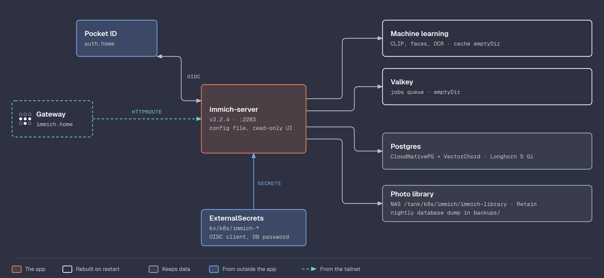

# Immich

The photo library, the first app on the cluster: Immich v3 with its
database on Longhorn and the photos on the NAS, reached at
`https://immich.home.<domain>` and logged in through Pocket ID.



## Database

[Immich](https://immich.app/) v3 needs Postgres with the VectorChord
extension. Its chart recommends exactly this setup, and
[gitops/projects/immich](../gitops/projects/immich/) follows it:

| File | What |
|------|------|
| `database/cluster.yaml` | A one-instance `Cluster` on Longhorn (5 Gi), Postgres 18, with the VectorChord extension mounted as an image (`vchord-scratch`) and loaded at start. A `Database` resource creates the extensions Immich uses |
| `library.yaml` | The photo library, a claim on the `nas` storage class: the files live on `pve-desktop` in `/tank/k8s/immich/immich-library` |
| `database/secret.yaml` | An `ExternalSecret` with the database user and password from OpenBao `kv/k8s/immich-database`. CloudNativePG applies it to the `app` role through `managed.roles` and follows changes (`cnpg.io/reload`) |
| `repository.yaml`, `release.yaml` | The Immich chart from its OCI registry, with Valkey on, the library claim, and the database credentials from that secret. CloudNativePG's own generated `immich-database-app` is not used |
| `route.yaml` | The `HTTPRoute` for `immich.home.<domain>` on the Gateway |
| `config.yaml` | Immich's settings as a file (`IMMICH_CONFIG_FILE`): the external address and login through Pocket ID. An `ExternalSecret` template renders it: Flux fills `${DOMAIN}`, External Secrets the OIDC client from `kv/k8s/immich-oauth`. With a config file the settings page is read-only, git is the source. A change needs `kubectl -n immich rollout restart deploy/immich-server` |

| Data | Where | Why |
|------|-------|-----|
| Photos and videos | NAS, NFS over WiFi | Large, written once, read often; fine at WiFi speed |
| Postgres | Longhorn on the worker data disks | A database over NFS on WiFi is slow and can corrupt |
| Machine learning cache, Valkey | `emptyDir` | Rebuilt on restart |

The Flux step `immich` waits for `cnpg`, `longhorn` and `nfs-config`
([gitops/flux/projects.yaml](../gitops/flux/projects.yaml)).

The library has a real limit of 400G, a ZFS project quota on its folder
([NAS, Quotas](nas.md#quotas)), and the claim says 400 Gi to match.

## Resources

Every pod has a memory limit and CPU and memory requests. No CPU limits:
they throttle a pod even when the CPU is idle, and a burst of thumbnails
or face detection should use the free cores.

| Pod | CPU request | Memory request | Memory limit |
|-----|-------------|----------------|--------------|
| server | 250m | 512Mi | 4Gi |
| machine-learning | 250m | 1Gi | 4Gi |
| valkey | 50m | 64Mi | 256Mi |
| database | 100m | 256Mi | 1Gi |

Under load the server sat near 3.8Gi of its 4Gi, but only
1.3Gi of that was its own memory; the rest was file cache, which the
kernel frees first. Check what a pod really uses with `kubectl top` or
`anon` in its cgroup:

```bash
kubectl -n immich exec deploy/immich-server -- grep -E '^(anon|file) ' /sys/fs/cgroup/memory.stat
```

## Deploy

Immich runs in two Flux steps: `immich-database` first, then `immich`.
With one step, the server started before the `Database` resource had
created the extensions and crashed on `permission denied to create
extension "vector"`. The namespace, the database `Cluster` and the library
claim carry `kustomize.toolkit.fluxcd.io/prune: disabled`, so moving or
deleting files in git never deletes the photos or the database.

The admin account was created through the Immich API with a generated
password, kept in OpenBao `kv/immich`.

## Settings

Every setting was read back from `/api/system-config` and compared with
the defaults. Changed in [config.yaml](../gitops/projects/immich/config.yaml):

| Setting | Value | Why |
|---------|-------|-----|
| `server.externalDomain` | `https://immich.home.<domain>` | Share links and the mobile app get the right address |
| `oauth` | Pocket ID, button "Login with Pocket ID", no auto-register | Same login as OpenBao and Proxmox; only users that already exist can log in |
| `passwordLogin` | on | Fallback while Pocket ID is new |
| `server.publicUsers` | off | Users do not see the list of all users |
| `newVersionCheck` | off | Versions are pinned in git; no calls to GitHub, as for Pocket ID |
| `storageTemplate` | on, `{{y}}/{{y}}-{{MM}}-{{dd}}/{{filename}}` | Files on the NAS by date with their own names, readable over SMB and easy to back up. The template braces are escaped in the `ExternalSecret`, which also uses `{{ }}` |

Kept as they are:

| Setting | Default | Note |
|---------|---------|------|
| `backup.database` | every night at 02:00, keep 14 | Immich dumps its own database to `library/backups`, which is on the NAS: a database copy outside the cluster already |
| `machineLearning` | CLIP `ViT-B-32__openai`, faces `buffalo_l`, OCR | The small models, enough for 8 GB workers |
| `ffmpeg.accel` | disabled | No GPU |
| `map` | tiles from `tiles.immich.cloud` | The browser fetches map tiles from Immich's servers |
| `trash` | 30 days | |

## References

- [Immich documentation](https://immich.app/docs/)
- [Immich Helm chart](https://github.com/immich-app/immich-charts)
- [Immich config file](https://immich.app/docs/install/config-file/)
- [CloudNativePG](https://cloudnative-pg.io/documentation/current/)

[Back to the build log](../README.md#docs)
