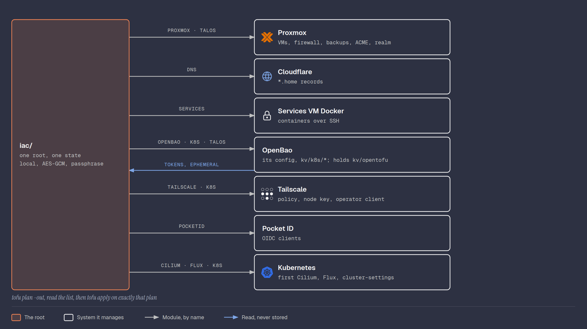

# OpenTofu

The VMs and containers on Proxmox as code, with
[OpenTofu](https://opentofu.org/) and the
[bpg/proxmox](https://registry.terraform.io/providers/bpg/proxmox/latest)
provider.



## Why OpenTofu

Terraform is what I use at work. OpenTofu is its open source fork, under
the Linux Foundation, and reads the same HCL and providers. It also has
state encryption built in, which Terraform does not, and that matters in
a public repo: the state holds the Talos machine secrets.

## Proxmox user and role

OpenTofu does not use `root`. It gets its own user with a role that holds
only what the provider needs. Both are created by the Ansible playbook
([Ansible](ansible.md)) and checked on every run.

| Item | Value |
|------|-------|
| User | `tofu@pve`, no password, so it cannot log in to the web UI |
| Role | `TofuProvisioner`, granted on `/` |
| Token | `tofu@pve!opentofu`, privilege separation off |

The role's privileges:

| Privilege | Why |
|-----------|-----|
| `Datastore.AllocateSpace`, `Datastore.Audit` | Create VM and container disks |
| `Datastore.AllocateTemplate` | Download the Talos ISO and the container template |
| `SDN.Use` | Attach VMs to `vmbr0` |
| `Sys.Audit` | Read node information |
| `Sys.Modify` | Required by the ISO download API. The broadest one here |
| `VM.Allocate`, `VM.Audit`, `VM.Clone`, `VM.PowerMgmt` | Create, read, clone, start and stop VMs and containers |
| `VM.Backup` | Put VMs and containers in a backup job |
| `VM.Config.*` (CD-ROM, CPU, Cloudinit, Disk, HWType, Memory, Network, Options) | Configure them |
| `VM.GuestAgent.Audit` | Read the IPs reported by the guest agent |

Not included: managing users, permissions or groups, the console,
host power, snapshots and migration.

A backup job also needs `Datastore.Allocate` on the storage it writes to.
That privilege can change or remove the storage and delete any volume on
it, backups included, so it is not in the main role. A second role,
`TofuBackupStorage`, adds it on `/storage/local` only:

| Role | Path | Privileges |
|------|------|------------|
| `TofuProvisioner` | `/` | The table above |
| `TofuBackupStorage` | `/storage/local` | `Datastore.Allocate`, `Datastore.AllocateSpace`, `Datastore.AllocateTemplate`, `Datastore.Audit` |
| `TofuRealms` | `/access/realm` | `Realm.Allocate`, for the Pocket ID realm ([Services](sso.md#logging-in-to-openbao-and-proxmox)) |

The second role repeats the storage privileges of the first on purpose.
In Proxmox a permission entry on a more specific path replaces the
inherited one for the same user. With only `Datastore.Allocate` there,
the token lost `Datastore.Audit` on `local`, could no longer see the
Debian template, and the next plan wanted to destroy and recreate both
containers. The `0 to destroy` line caught it before anything was
applied.

**Privilege separation off:** the token gets exactly the user's
permissions. With it on, the token needs its own permission entry and
gets the overlap of both. That helps when a user has broad rights and a
token should only get a slice; `tofu@pve` has nothing but this role, so
it would only mean managing the same permissions twice.

## API token

Created by hand, since it is a secret, in **Datacenter → Permissions →
API Tokens → Add**:

| Field | Value |
|-------|-------|
| User | `tofu@pve` |
| Token ID | `opentofu` |
| Privilege Separation | unticked |
| Expire | never |

The popup shows the secret once. It went into OpenBao at `kv/opentofu`
as `proxmox_api_token`, in the format token ID, `=`, secret
(`tofu@pve!opentofu=<secret>`), with a break-glass copy in Bitwarden. It
first lived in a SOPS file, until OpenBao was running.

A check that never prints the secret:

```bash
curl -s -H "Authorization: PVEAPIToken=$(bao kv get -mount=kv -field=proxmox_api_token opentofu)" \
  https://pve.home.<domain>/api2/json/version   # version 9.2.20
```

Without the header the same request gets `401`.

## Install

On the laptop, from the official release, checked against its SHA256SUMS:

```bash
gh release download v1.12.6 -R opentofu/opentofu \
  -p 'tofu_1.12.6_linux_amd64.tar.gz' -p 'tofu_1.12.6_SHA256SUMS'
grep ' tofu_1.12.6_linux_amd64.tar.gz$' tofu_1.12.6_SHA256SUMS | sha256sum -c -
tar xzf tofu_1.12.6_linux_amd64.tar.gz tofu && install -m 755 tofu ~/.local/bin/
```

## Project

One root in [iac/](../iac/), one state. The root reads
OpenBao, configures the providers and calls one module per area:

| File | What it is |
|------|------------|
| [versions.tf](../iac/versions.tf) | Provider versions, state encryption |
| [variables.tf](../iac/variables.tf) | The passphrase, the `pve` address, the domain, the email |
| [secrets.tf](../iac/secrets.tf) | Reads `kv/opentofu`, `kv/config`, `kv/services/*` and `kv/talos` from OpenBao |
| [providers.tf](../iac/providers.tf) | Proxmox, Cloudflare, Docker, Tailscale, OpenBao, Pocket ID, Helm and Kubernetes, configured with those secrets and the cluster's admin credentials |
| [main.tf](../iac/main.tf) | The module calls, the Talos node list, and the outputs: the Proxmox version, `talosconfig`, `kubeconfig` |
| `terraform.tfstate`, `terraform.tfvars` | Local only, git-ignored |
| `.terraform.lock.hcl` | Pinned provider checksums, kept in git |

| Module | What it manages |
|--------|-----------------|
| [proxmox](../iac/modules/proxmox/) | The Debian cloud image, the services VM and its firewall, the daily backup job, the ACME plugin and certificate, the Pocket ID realm |
| [dns](../iac/modules/dns/) | The `*.home.<domain>` records: services on Caddy, cluster apps on the Gateway |
| [services](../iac/modules/services/) | The containers on the services VM, each config file next to its `.tf` ([Services](services.md)) |
| [pocketid](../iac/modules/pocketid/) | The OIDC clients for OpenBao, Proxmox and Immich |
| [openbao](../iac/modules/openbao/) | OpenBao's own configuration: `kv`, `userpass`, the `admin` policy, my user's token settings, OIDC login, the JWT login for the cluster |
| [tailscale](../iac/modules/tailscale/) | The tailnet policy, the nodes' auth key, the Gateway's tailnet IP ([Tailscale](tailscale.md#keys-and-clients-made-by-opentofu)) |
| [talos](../iac/modules/talos/) | The image, the VMs and their firewall, the machine configs from [talos/](../talos/), bootstrap, and the cluster secrets in OpenBao ([Talos](talos.md)) |
| [cilium](../iac/modules/cilium/) | Cilium, once, so a new cluster has a network before Flux runs. `ignore_changes = all`: Flux owns it afterwards |
| [flux](../iac/modules/flux/) | The Flux Operator and the `FluxInstance` |
| [k8s](../iac/modules/k8s/) | What the cluster needs from outside: `cluster-settings`, the operator's OAuth client, the copies in `kv/k8s/*` |

| Provider | Version | Used for |
|----------|---------|----------|
| `bpg/proxmox` | `~> 0.114` | VMs, firewall, backups, ACME, realm |
| `cloudflare/cloudflare` | `~> 5.26` | DNS |
| `kreuzwerker/docker` | `~> 4.6` | The services VM's containers, over SSH |
| `hashicorp/vault` | `~> 5.12` | OpenBao, reads and its configuration |
| `tailscale/tailscale` | `~> 0.29` | Policy, keys, OAuth clients, devices |
| `trozz/pocketid` | `~> 2.5` | OIDC clients. Community provider without a signing key in the registry |
| `siderolabs/talos` | `~> 0.12` | Image Factory, machine configs, bootstrap |
| `hashicorp/helm` | `~> 3.3` | Cilium and Flux |
| `hashicorp/kubernetes` | `~> 3.0` | `cluster-settings` |
| `hashicorp/tls` | `~> 4.1` | The public half of the cluster's service-account key |

Providers are configured only in the root and passed down by default.
Secrets reach a module as inputs: the ACME token is an `ephemeral`
variable, so it never lands in the state, and the service secrets are a
`sensitive` map.

The move from flat files to modules was one apply with `moved` blocks:
33 resources changed address, and only the Caddy image was rebuilt,
because its build context path changed. The `moved` blocks were deleted
after the apply.

Running it, after one `bao login`:

```bash
cd iac
export TF_VAR_state_passphrase="$(bao kv get -mount=kv -field=state_passphrase services/opentofu)"
tofu plan -out=change.tfplan
tofu show -json change.tfplan | jq -r '.resource_changes[] | select(.change.actions != ["no-op"] and .change.actions != ["read"]) | "\(.change.actions) \(.address)"'
tofu apply change.tfplan
```

Every change goes through a saved plan: the list of what changes is read
first, and exactly that plan is applied, nothing that appeared since. A
plan with a `delete` that was not expected stops there.

`terraform.tfvars` holds the domain, the `pve` tailnet address and the
Let's Encrypt email: the settings OpenTofu needs even when OpenBao is
down. Everything secret comes from OpenBao.

### Secrets from OpenBao

The `hashicorp/vault` provider works with OpenBao. It finds OpenBao
through `VAULT_ADDR` and the login through `~/.vault-token`:

| Block | Reads | Kept in the state |
|-------|-------|-------------------|
| `ephemeral "vault_kv_secret_v2" "opentofu"` | The Proxmox, Cloudflare and Tailscale credentials | No: ephemeral values only exist during the run |
| `data "vault_kv_secret_v2" "config"` | Zone ID, the services tailnet IP | Yes, none of it is secret |
| `data "vault_kv_secret_v2" "services"` | The stack's secrets | Yes, encrypted: the `docker` provider has no write-only arguments |

The Proxmox, Cloudflare and Tailscale providers take the tokens straight
from the ephemeral values. The `pve-acme` token reaches Proxmox through
`data_wo`, a write-only argument, so it is never stored either. The
provider warns that the data sources are deprecated in favour of
ephemeral reads, but values in normal resource arguments cannot be
ephemeral.

### Reaching Proxmox

OpenTofu talks to `https://proxmox.home.<domain>:8006`: a DNS record
pointing straight at `pve`'s tailnet IP, and a second name on Proxmox's
own Let's Encrypt certificate. It does not go through Caddy, so an apply
that replaces Caddy or Tailscale on the services VM cannot cut its own
connection halfway.

### How the state got here

The state was first a file in git, then in Garage with OpenBao's Transit
engine as the key, then split in two projects. Each step solved one loop
and found the next: a state in Garage or encrypted by OpenBao cannot be
written by an apply that restarts Garage or leaves OpenBao sealed. The
answer was one local state with a passphrase, and nothing in the path
running on the services VM. The old states were removed from the git
history.

A local state has no copy off the laptop. It can be rebuilt with imports
if lost, and a copy off the laptop is [#20](https://github.com/jotavare/talos-homelab/issues/20).

## State encryption

OpenTofu encrypts the state and every saved plan with AES-GCM, with a key
derived (PBKDF2) from the passphrase, and `enforced = true` makes it
refuse to write anything unencrypted. `tofu` asks for the passphrase if
`TF_VAR_state_passphrase` is not set.

## First plan

Only reads Proxmox, to prove the connection, the token and the
encryption:

```bash
tofu plan
# module.proxmox.data.proxmox_version.pve: Read complete
# + proxmox_version = "9.2.20"
```

## Services VM

In [modules/proxmox/vm.tf](../iac/modules/proxmox/vm.tf). It replaced the first
OpenBao container, which had the same ID and IP. What runs on it is in
[Services](services.md).

| Resource | What it does |
|----------|--------------|
| `proxmox_download_file.debian_13_cloud` | Downloads the dated Debian 13 cloud image to `local` (content type `import`) and checks it against Debian's SHA512 |
| `proxmox_virtual_environment_vm.services` | VM `130`: q35, UEFI, 2 cores (`host`), 1.5 GB fixed, 32 GB disk imported from the image with `discard` and `iothread`, `192.168.1.30`, cloud-init user `debian` with my SSH public key, guest agent on, starts at boot with `order = 1` |
| `proxmox_virtual_environment_firewall_options.services` | VM firewall on, inbound `DROP` |
| `proxmox_virtual_environment_firewall_rules.services` | SSH only from `pve` (`.10`), UDP `41641` for Tailscale direct connections |

The container and the VM could not both be ID `130`, so the swap was two
applies: first the container out of the config (`3 to destroy`, after its
data and a protected backup were saved), then the VM in (`3 to add`).

The guest agent started disabled: Proxmox only adds the agent's serial
port when the option is on, and the cloud image does not ship the agent.
Once Ansible installed it, turning the option on restarted the VM once.

The SSH public key is read from `~/.ssh/id_ed25519.pub` at plan time, so
it is not written in the repo.

## Backup job

In [modules/proxmox/backups.tf](../iac/modules/proxmox/backups.tf): the daily backup of
both containers, described in
[Proxmox, Container backups](proxmox.md#container-backups). The
guests come from the container resources, so a new container is one line
in `vmid`.

The job was first created by hand to test it, then brought under
OpenTofu with an `import` block, removed again after the apply:

```hcl
import {
  to = proxmox_backup_job.containers
  id = "daily-containers"
}
```

```bash
tofu plan    # Plan: 1 to import, 0 to add, 0 to change, 0 to destroy.
tofu apply
```

Drift test: `keep-last` changed to 3 on the host showed up in the next
plan as `"keep-last" = "3" -> "7"`, and the apply set it back.

The token can edit this job but, with `Datastore.Allocate` on `local`, it
could also delete the backups there. Worth another look with Proxmox
Backup Server, which has its own users and can keep pruning to itself.

## DNS and certificates

Trusted certificates for the admin UIs, from Let's Encrypt, with nothing
exposed to the internet: the DNS-01 challenge proves the domain with a TXT
record in Cloudflare instead of a web server.

### Names

Public A records in Cloudflare point each name at its tailnet IP:

| Name | Points to |
|------|-----------|
| `pve.home.<domain>` | The services stack's tailnet IP; Caddy forwards to the web UI |
| `immich.home.<domain>` | The cluster Gateway's tailnet IP, read from the Tailscale API (`cluster_apps` in `main.tf`) |
| `proxmox.home.<domain>` | `pve`'s own tailnet IP, port `8006`; used by OpenTofu |
| `s3.home.<domain>` | The services stack's tailnet IP; Caddy forwards to Garage |
| `auth.home.<domain>` | The services stack's tailnet IP; Caddy forwards to Pocket ID |
| `openbao.home.<domain>` | The services stack's tailnet IP; Caddy forwards to OpenBao |

They resolve for anyone, but the `100.x` addresses only answer inside the
tailnet. The other options were split DNS on the tailnet (one more
service to run, and nothing resolves when it is down) and `/etc/hosts`
on every device (no phones). Public records reveal the host names, so Caddy's
certificates are per host. The cluster uses one wildcard,
`*.home.<domain>`, so a new app needs no new certificate.

### Cloudflare tokens

Account API tokens, each limited to **DNS: Edit** on the one zone, so a
leaked token can only change this domain's records. One per job, so each
can be revoked alone:

| Token | Used by | Kept in |
|-------|---------|---------|
| `opentofu-dns` | OpenTofu, for the records | OpenBao `kv/opentofu` |
| `pve-acme` | Proxmox, to renew its certificate | OpenBao `kv/opentofu`, then Proxmox's own plugin config |
| `caddy-dns` | Caddy, for the services stack | OpenBao `kv/services/caddy` |

The zone ID is in `kv/config`, so the tokens need no Zone Read
permission. The `pve-acme` token reaches Proxmox through `data_wo`, a
write-only argument: OpenTofu sends it but never stores it in the state.
Changing it means raising `data_wo_version`.

### Proxmox web UI certificate

| Part | Where | Why |
|------|-------|-----|
| ACME account `default`, Let's Encrypt | Ansible ([Ansible](ansible.md)) | The API only lets `root@pam` register an account |
| DNS plugin `cloudflare` (`proxmox_acme_dns_plugin`) | OpenTofu | Needs `Sys.Modify` on `/`, already in the role |
| Certificate for `pve.home.<domain>` and `proxmox.home.<domain>` (`proxmox_acme_certificate`) | OpenTofu, with `force = true` so a change of names can replace the current certificate | Needs `Sys.Modify` on `/nodes/pve`, already in the role |
| Renewal | Proxmox's daily `pve-daily-update` timer | Renews by itself 30 days before expiry, no OpenTofu run needed |

Proxmox cannot issue a wildcard: its ACME domain format only allows
plain labels, so `*` is refused. With per-host certificates that does not
matter.

```bash
tofu plan    # Plan: 4 to add, 0 to change, 0 to destroy.
tofu apply   # the certificate took 51 seconds
```

Checks:

```bash
dig +short @1.1.1.1 pve.home.<domain>          # the host's 100.x address
echo | openssl s_client -connect pve.home.<domain>:8006 2>/dev/null \
  | openssl x509 -noout -issuer -dates          # issuer=C=US, O=Let's Encrypt, 90 days
```

`https://pve.home.<domain>:8006` now opens with no browser warning.

## References

- [OpenTofu](https://opentofu.org/)
- [OpenTofu state encryption](https://opentofu.org/docs/language/state/encryption/)
- [bpg/proxmox provider](https://registry.terraform.io/providers/bpg/proxmox/latest/docs)
- [Proxmox user management and API tokens](https://pve.proxmox.com/wiki/User_Management)
- [Proxmox certificate management](https://pve.proxmox.com/wiki/Certificate_Management)
- [Cloudflare OpenTofu provider](https://registry.terraform.io/providers/cloudflare/cloudflare/latest/docs)
- [Let's Encrypt challenge types](https://letsencrypt.org/docs/challenge-types/)

[Back to the build log](../README.md#docs)
