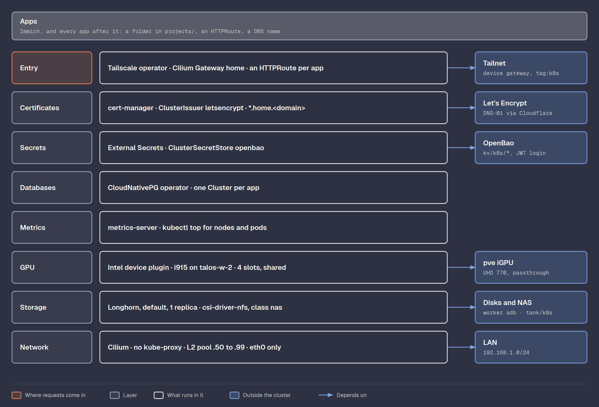

# Platform

What every app in the cluster stands on: the network and its entry
point, certificates, secrets from OpenBao, and storage. All of it is
applied by Flux ([GitOps](gitops.md)) except Cilium's first install,
which OpenTofu does so a new cluster has a network.



## Cilium

Flux runs as pods, and pods need a network first, so Flux cannot install
the network. OpenTofu installs Cilium once with the Helm provider
([iac/modules/cilium](../iac/modules/cilium/)); Flux takes the same
release over later.

The values live in
[gitops/infrastructure/cilium/values.yaml](../gitops/infrastructure/cilium/values.yaml),
read by OpenTofu now and by Flux later, so they exist once:

| Value | Why |
|-------|-----|
| `kubeProxyReplacement: true` | Cilium handles Services with eBPF, kube-proxy is off |
| `k8sServiceHost: localhost`, `k8sServicePort: 7445` | KubePrism, Talos' local API proxy on every node. Cilium needs the API before Services exist |
| `devices: eth0` | Never `tailscale0` |
| `cgroup.autoMount.enabled: false`, `hostRoot: /sys/fs/cgroup` | Talos mounts cgroups itself |
| `securityContext.capabilities` | The list Talos documents, without `SYS_MODULE`: Talos does not let pods load kernel modules |
| `ipam.mode: kubernetes` | Pod IPs from each node's Kubernetes pod range |
| `operator.replicas: 1` | One is enough for three nodes |

```bash
kubectl get nodes   # all Ready
kubectl -n kube-system exec ds/cilium -c cilium-agent -- cilium-dbg status --brief   # OK
```

## NFS storage

[gitops/infrastructure/nfs](../gitops/infrastructure/nfs/): the
[csi-driver-nfs](https://github.com/kubernetes-csi/csi-driver-nfs) chart,
then in `config/` the `nas` storage class:

| Setting | Value | Why |
|---------|-------|-----|
| Server, share | `192.168.1.11`, `/tank/k8s` | The NAS ([NAS](nas.md)) |
| `subDir` | `<namespace>/<pvc name>` | Readable folder names on the NAS instead of `pvc-<uuid>` |
| `reclaimPolicy` | `Retain` | Deleting a claim never deletes the photos |
| Mount options | `nfsvers=4.2`, `hard` | The NAS only serves 4.1 and 4.2. `hard` makes writes wait through a WiFi drop instead of failing |

Tested with a claim and a non-root pod that wrote a file, read back on the
NAS. The pod needs `runAsGroup` and `fsGroup`: the driver chowns the new
folder to the `fsGroup`, and without a matching group the write is
refused. The test volume and its folder were deleted afterwards.

## Longhorn

Block storage for databases and anything that should not sit on NFS over
WiFi. Two parts:

**A data disk per worker.** Talos 1.14 no longer has kubelet extra
mounts; the way to give Longhorn its own place is a `UserVolumeConfig`.
The 80 GB system disk was already all `EPHEMERAL`, so each worker got a
second 50 GB disk (`scsi1`, the `data` field in
[iac/main.tf](../iac/main.tf)), hot-plugged without a reboot.
[talos/worker.yaml](../talos/worker.yaml) formats it as XFS and Talos
mounts it at `/var/mnt/longhorn`:

```bash
talosctl -n 192.168.1.21 get volumestatus u-longhorn   # disk, ready, /dev/sdb, 54 GB
```

**Longhorn through Flux**, in
[gitops/infrastructure/longhorn](../gitops/infrastructure/longhorn/):

| Value | Why |
|-------|-----|
| Namespace labelled `pod-security ... privileged` | Longhorn's managers need host access; the cluster default is `baseline` |
| `defaultDataPath: /var/mnt/longhorn` | The user volume above |
| `defaultReplicaCount: 1`, `defaultClassReplicaCount: 1` | Every replica would land on the same NVMe anyway (README trade-offs) |
| `persistence.defaultClass: true` | Claims without a storage class get Longhorn; the NAS is asked for by name, `nas` |
| CSI sidecars and UI at one replica | Saves RAM on a two-worker cluster |
| `preUpgradeChecker.jobEnabled: false` | The checker job does not work with Flux' Helm upgrades |

Longhorn runs on the workers only: the control plane keeps its
`NoSchedule` taint.

The install was also what exposed the `pve` NIC hang
([Proxmox, NIC hang](proxmox.md#nic-hang)).

## CloudNativePG

[CloudNativePG](https://cloudnative-pg.io/) runs Postgres as a
Kubernetes resource: a `Cluster` gets its pods, volumes, users and
backups from the operator in
[gitops/infrastructure/cnpg](../gitops/infrastructure/cnpg/). Immich is
the first database ([Immich, Database](immich.md#database)).

## Secrets, certificates and the Gateway

Apps are reached the way they would be in a company cluster: one Gateway,
one `HTTPRoute` per app, certificates from cert-manager, secrets from the
secret store. Nothing outside the cluster changes for a new app except
its DNS name.

```text
laptop (tailnet) -> gateway.<tailnet>.ts.net (Tailscale proxy pod)
                 -> Cilium Gateway "home" (TLS, *.home.<domain>)
                 -> HTTPRoute -> immich-server
```

| Part | Where | Does |
|------|-------|------|
| External Secrets Operator | [infrastructure/external-secrets](../gitops/infrastructure/external-secrets/) | Copies OpenBao secrets into Kubernetes Secrets. The `openbao` `ClusterSecretStore` logs in with the operator's service-account token |
| OpenBao login for the cluster | [iac/modules/openbao/kubernetes.tf](../iac/modules/openbao/kubernetes.tf) | A JWT login (`auth/kubernetes`) that checks tokens against the cluster's service-account public key, taken from the Talos secrets. OpenBao never calls the cluster. The role accepts only `external-secrets/external-secrets`, audience `openbao`, policy read-only on `kv/k8s/*` and `kv/config` |
| `cluster-settings` | Made by OpenTofu in `flux-system` | `DOMAIN` and `TAILNET` for Flux' `postBuild` substitution, so manifests say `${DOMAIN}` and the public repo never holds the domain |
| cert-manager | [infrastructure/cert-manager](../gitops/infrastructure/cert-manager/) | The `letsencrypt` `ClusterIssuer`, DNS-01 through Cloudflare with the token from `kv/k8s/cert-manager` |
| Gateway API CRDs | [infrastructure/gateway-api](../gitops/infrastructure/gateway-api/) | Upstream `standard-install.yaml` v1.6.1, vendored: Flux does not fetch remote files |
| Cilium Gateway | [infrastructure/gateway](../gitops/infrastructure/gateway/) | `GatewayClass` `cilium`, the wildcard certificate `*.home.<domain>`, and the `Gateway` `home` with one HTTPS listener. Its Service gets `192.168.1.51` on the LAN and is exposed on the tailnet |
| Tailscale operator | [infrastructure/tailscale](../gitops/infrastructure/tailscale/) | Watches Services with `tailscale.com/expose`: the Gateway becomes the tailnet device `gateway` |
| DNS | [iac/modules/dns](../iac/modules/dns/) | `cluster_apps` in [iac/main.tf](../iac/main.tf) point at the Gateway's tailnet IP, read from the Tailscale API |

Things found on the way:

- Pods already reach OpenBao: the nodes route `100.x` through their own
  Tailscale and masquerade pod traffic, and `tag:talos` may reach
  `tag:services:443`.
- The Cilium chart did not create the `GatewayClass`, so it is in git.
- Turning on Gateway support also needs the Cilium operator restarted:
  `rollOutCiliumPods` only restarts the agents, and they wait for CRDs the
  operator registers.
- Cilium's values ConfigMap carries `reconcile.fluxcd.io/watch: Enabled`,
  so a change upgrades the release at once instead of within 30 minutes.
- The Gateway proxy needed a Tailnet Lock signature
  ([Tailscale](tailscale.md#devices-made-by-the-kubernetes-operator)).

Adding an app: its folder in `projects/`, an `HTTPRoute` with
`<name>.home.${DOMAIN}`, and its name in `cluster_apps`.

## Metrics

[metrics-server](https://github.com/kubernetes-sigs/metrics-server)
3.14.0 reads CPU and memory from each kubelet, so `kubectl top` works and
memory limits can be checked against what pods really use. Without it,
`kubectl top` fails with `Metrics API not available`.

The kubelet serves a certificate that Talos signs itself, not the
cluster CA, so metrics-server runs with `--kubelet-insecure-tls`. It only
talks to the nodes inside the cluster. The proper way is in the README's
POC trade-offs.

```bash
kubectl top nodes
kubectl top pods -n immich
```

## GPU

The i5-12500T's Intel UHD 770 is passed through to `talos-w-2` for
Immich: video transcoding and machine learning, which ran on the CPU and
kept both workers near 100%.

| Layer | What | Where |
|-------|------|-------|
| Host | IOMMU is on by default; the iGPU is alone in IOMMU group 0. `vfio-pci` claims it at boot before `i915` or `xe` can | [proxmox/vfio/](../proxmox/vfio/), `proxmox_host` role |
| Proxmox | A PCI resource mapping `igpu` (`0000:00:02.0`, `8086:4690`), attached to the VM as `hostpci0` with PCIe on | [iac/modules/talos/gpu.tf](../iac/modules/talos/gpu.tf), `gpu = true` on the node in `iac/main.tf` |
| Talos | The `i915` extension, and the node label `intel-gpu=true` in a `KubeNodeConfig` | [talos/gpu.yaml](../talos/gpu.yaml), [Talos, Image](talos.md#image) |
| Kubernetes | Intel's GPU device plugin, straight from its repository at a pinned tag, only on the labelled node, `-shared-dev-num=4` | `intel-gpu` and `intel-gpu-plugin` in [gitops/flux/infrastructure.yaml](../gitops/flux/infrastructure.yaml) |
| Immich | `gpu.intel.com/i915: 1` on the server and machine learning | [Immich, Resources](immich.md#resources) |

Full passthrough, not SR-IOV: the UHD 770 can split into 7 virtual GPUs,
but the guest needs a driver that supports them, which the Talos kernel
does not promise. One worker with the whole GPU is enough for one app.
The host has no screen to lose; its console stays on the serial and web
console.

The VM restart that attaches the device let Proxmox move the iGPU from
`i915` to `vfio-pci` without a host reboot. The files in `/etc/modprobe.d`
make that the default from the next boot. The node label sits in
`KubeNodeConfig`, not `machine.nodeLabels`: Talos 1.14 refuses the old
field once a `KubeNodeConfig` document exists (`.machine.nodeLabels is
already set in v1alpha1 config`).

The plugin needs the host's `/dev/dri`, which Talos' default `baseline`
pod security forbids, so it has its own namespace with
`pod-security.kubernetes.io/enforce: privileged`. With
`-shared-dev-num=4` the node offers `gpu.intel.com/i915: 4`. Two Immich
pods use it, and a rolling update starts the new pod before it stops the
old one, so each needs a spare slot: with 2, the new machine learning
pod stayed `Pending` until the old one was gone, which never happened.
The slots only limit scheduling, every pod shares the same GPU.

```bash
talosctl -n 192.168.1.22 ls /dev/dri
kubectl get node talos-w-2 -o jsonpath='{.status.allocatable.gpu\.intel\.com/i915}'
```

## References

- [Cilium on Talos](https://www.talos.dev/v1.14/kubernetes-guides/network/deploying-cilium/)
- [Cilium Gateway API](https://docs.cilium.io/en/stable/network/servicemesh/gateway-api/gateway-api/)
- [Cilium L2 announcements](https://docs.cilium.io/en/stable/network/l2-announcements/)
- [Longhorn on Talos](https://longhorn.io/docs/latest/advanced-resources/os-distro-specific/talos-linux-support/)
- [csi-driver-nfs](https://github.com/kubernetes-csi/csi-driver-nfs)
- [External Secrets, HashiCorp Vault provider](https://external-secrets.io/latest/provider/hashicorp-vault/)
- [cert-manager, Cloudflare DNS-01](https://cert-manager.io/docs/configuration/acme/dns01/cloudflare/)
- [Tailscale Kubernetes operator](https://tailscale.com/kb/1236/kubernetes-operator)

[Back to the build log](../README.md#docs)
